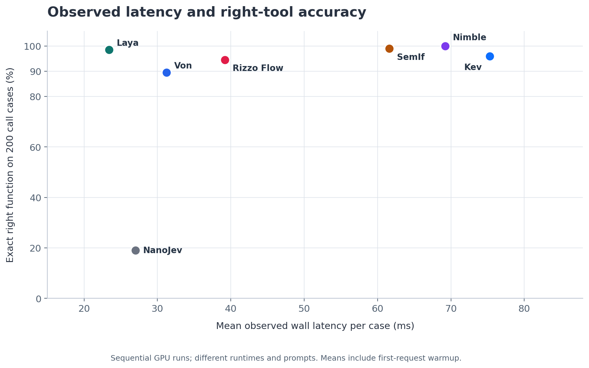
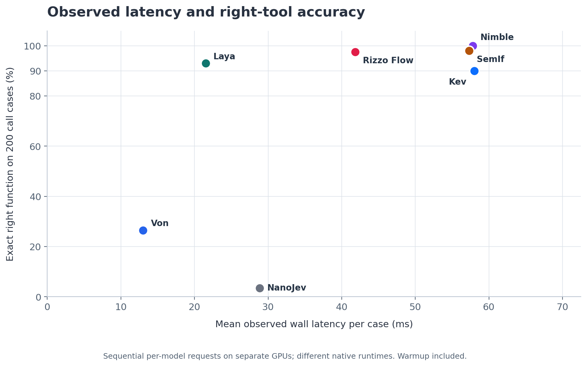

# Jev model performance

This repository compares seven Jev-style decision systems on two **250-case capability-routing pilots**, adapted from Berkeley Function Calling Leaderboard (BFCL) V1 and the V4 Live corpus. Both sets have complete runs for Laya, Kev-0.8B, Nimble-9B, SemIf on frozen Qwen3.5-4B, Rizzo Flow 4B, Von, and NanoJev. **Jev chooses the capability; the chat model supplies arguments and handles execution.**

## Datasets and prompts

| Pilot | Cases | Model-facing tool cards | Hugging Face dataset | Local data and viewer |
| --- | --- | --- | --- | --- |
| **BFCL V1** | 250: 200 tool calls + 50 no-call | Compact function descriptions; original V1 meta cards | [pyuvraj/bfcl-v1-jev-routing](https://huggingface.co/datasets/pyuvraj/bfcl-v1-jev-routing) | [Cases](data/bfcl_v1/cases.jsonl) · [Viewer](data/bfcl_v1/viewer.html) · [Manifest](data/bfcl_v1/manifest.json) |
| **BFCL V4 Live** | 250: 200 tool calls + 50 no-call | Full original function descriptions; neutral meta cards | [pyuvraj/bfcl-v4-jev-routing](https://huggingface.co/datasets/pyuvraj/bfcl-v4-jev-routing) | [Data and review protocol](data/bfcl_v4/README.md) · [Cases](data/bfcl_v4/cases.jsonl) · [Viewer](data/bfcl_v4/viewer.html) |

The frozen V4 set has **no exact or normalized user-request matches** against all 2,000 V1 source rows or our frozen V1 subset, and no internal normalized request duplicates. The [documented normalization and validation](data/bfcl_v4/README.md#source-and-selection) do not guarantee detection of every semantic paraphrase. These are separate curated pilots; changed requests, full descriptions, and neutral meta cards mean score differences do not isolate a benchmark-version effect. The Live categories originated before V4 and remain in its corpus.

The public V4 release includes the 250-row `test` split, original frozen cases and review evidence, seven models' selection logs, results, charts, licenses, and an offline viewer. The [publication record](docs/BFCL_V4_HUGGINGFACE.md) pins its Hub revision and records file verification. Load that frozen release with:

```python
from datasets import load_dataset

cases = load_dataset(
    "pyuvraj/bfcl-v4-jev-routing",
    "default",
    split="test",
    revision="9cd92d8c7789eb390d271adbd7312bbb3e3657cf",
)
assert len(cases) == 250
```

## Results at a glance

**Exact right tool** requires the exact function ID on the 200 tool-required cases. **Routing** uses all 250 cases: the correct function on positives, or any of `no_tool`, `clarify`, and `cannot_answer` on negatives. Neither metric scores arguments, execution, final answers, or task completion. Exact-action scores with canonical `no_tool` on negatives are retained in the full reports.

### BFCL V1 — frozen 250-case pilot

Source: [generated V1 comparison CSV](results/bfcl_v1_comparison.csv), from the seven saved per-case logs. Recorded on `vp-dgx-65`, NVIDIA H100; all 250 decisions per model completed with zero request errors.

| Model | Approx. parameters | Exact right tool /200 | Routing /250 | Mean latency | Median | P95 | Mean correct-route probability /250 |
| --- | ---: | ---: | ---: | ---: | ---: | ---: | ---: |
| [Laya typed-decisions](https://huggingface.co/convaiinnovations/laya-typed-decisions) | ~421M | **197/200 (98.5%)** | 240/250 (96.0%) | 23.4 ms | 17.0 ms | 32.8 ms | 72.7% |
| [Kev-0.8B](https://huggingface.co/jaredpalmer/kev-0.8b) | ~0.8B | **192/200 (96.0%)** | 241/250 (96.4%) | 75.3 ms | 73.8 ms | 79.9 ms | 71.0% |
| [Bespoke Nimble 9B](https://huggingface.co/bespokelabs/Bespoke-Nimble-9B) | ~9B | **200/200 (100.0%)** | 248/250 (99.2%) | 69.2 ms | 60.3 ms | 69.4 ms | 98.6% |
| [SemIf / frozen Qwen3.5-4B](https://huggingface.co/Qwen/Qwen3.5-4B) | ~4B | **198/200 (99.0%)** | 248/250 (99.2%) | 61.6 ms | 56.0 ms | 74.6 ms | 96.2% |
| [Rizzo Flow 4B Q8_0](https://huggingface.co/rizzoaiacademy/rizzo-flow) | ~4B | **189/200 (94.5%)** | 239/250 (95.6%) | 39.2 ms | 38.3 ms | 45.9 ms | 87.1% |
| [Von 1.3, chains off](https://huggingface.co/wfzyx/von) | ~395M | **179/200 (89.5%)** | 228/250 (91.2%) | 31.2 ms | 13.0 ms | 14.4 ms | 64.6% |
| [NanoJev unified-games-v1](https://huggingface.co/C-Tianyu/NanoJev) | ~0.6B | **38/200 (19.0%)** | 88/250 (35.2%) | 27.0 ms | 27.4 ms | 36.0 ms | 33.0% |

[Full V1 results and logs](results/README.md) · [V1 chart notes and all three figures](charts/README.md) · [Fresh V1 run commands](inference/RUNBOOK.md)



### BFCL V4 Live — frozen 250-case pilot

Source: [generated V4 comparison CSV](results/bfcl_v4_comparison.csv), from the seven saved per-case logs. Recorded on `vp-dgx-59`, NVIDIA H100; all 250 decisions per model completed with zero request errors.

| Model | Approx. parameters | Exact right tool /200 | Routing /250 | Mean latency | Median | P95 | Mean correct-route probability /250 |
| --- | ---: | ---: | ---: | ---: | ---: | ---: | ---: |
| [Laya typed-decisions](https://huggingface.co/convaiinnovations/laya-typed-decisions) | ~421M | **186/200 (93.0%)** | 224/250 (89.6%) | 21.5 ms | 17.1 ms | 30.6 ms | 61.1% |
| [Kev-0.8B](https://huggingface.co/jaredpalmer/kev-0.8b) | ~0.8B | **180/200 (90.0%)** | 230/250 (92.0%) | 58.0 ms | 57.3 ms | 61.6 ms | 59.2% |
| [Bespoke Nimble 9B](https://huggingface.co/bespokelabs/Bespoke-Nimble-9B) | ~9B | **200/200 (100.0%)** | 249/250 (99.6%) | 57.8 ms | 47.6 ms | 67.6 ms | 98.2% |
| [SemIf / frozen Qwen3.5-4B](https://huggingface.co/Qwen/Qwen3.5-4B) | ~4B | **196/200 (98.0%)** | 244/250 (97.6%) | 57.3 ms | 50.3 ms | 61.3 ms | 91.9% |
| [Rizzo Flow 4B Q8_0](https://huggingface.co/rizzoaiacademy/rizzo-flow) | ~4B | **195/200 (97.5%)** | 241/250 (96.4%) | 41.8 ms | 40.4 ms | 52.5 ms | 92.6% |
| [Von 1.3, chains off](https://huggingface.co/wfzyx/von) | ~395M | **53/200 (26.5%)** | 103/250 (41.2%) | 13.0 ms | 12.9 ms | 13.8 ms | 38.8% |
| [NanoJev unified-games-v1](https://huggingface.co/C-Tianyu/NanoJev) | ~0.6B | **7/200 (3.5%)** | 56/250 (22.4%) | 28.8 ms | 25.9 ms | 34.7 ms | 30.3% |

[Full V4 results and logs](results/bfcl_v4.md) · [V4 chart notes and all three figures](charts/bfcl_v4/README.md) · [Fresh V4 run commands](inference/BFCL_V4.md)



Latencies use saved `wall_latency_ms` over **all 250 responses**, including recorded cold/warmup overhead and outliers. Native runtimes, precision, prompt encodings, and warmup/resume protocols differ; these are observed H100 response times, not a controlled speed or throughput comparison. V4 protocols are detailed in the [timing notes](results/bfcl_v4.md#timing-and-probability-interpretation).

Mean correct-route probability also uses **all 250 cases**: gold-function probability on positives and summed probability of `no_tool`, `clarify`, and `cannot_answer` on negatives. It is conditional on the offered options and is not calibrated across models. Parameter counts are rounded backbone/checkpoint sizes; decision heads and adapters may add parameters. The separate probability charts use only the 200 positive cases: [V1](charts/accuracy_vs_gold_function_probability.png) · [V4](charts/bfcl_v4/accuracy_vs_gold_function_probability.png). Model-size figures are preserved for [V1](charts/size_vs_right_tool_accuracy.png) and [V4](charts/bfcl_v4/size_vs_right_tool_accuracy.png).

### Model credits and references

The checkpoints and inference methods belong to their upstream authors; this repository contains benchmark inputs, adapters, and recorded selections, not redistributed model weights.

- **Laya:** [Convai Innovations checkpoint](https://huggingface.co/convaiinnovations/laya-typed-decisions) and [NandhaKishorM implementation](https://github.com/NandhaKishorM/laya).
- **Kev:** [Jared Palmer checkpoint](https://huggingface.co/jaredpalmer/kev-0.8b) and [implementation](https://github.com/jaredpalmer/kev).
- **Nimble:** [Bespoke Labs checkpoint](https://huggingface.co/bespokelabs/Bespoke-Nimble-9B) and [implementation](https://github.com/bespokelabsai/nimble).
- **SemIf:** [TheoLeeCJ scoring method](https://github.com/TheoLeeCJ/SemIf-OpenJev) evaluated with the [Qwen team's frozen Qwen3.5-4B checkpoint](https://huggingface.co/Qwen/Qwen3.5-4B); SemIf is not a separately trained checkpoint here.
- **Rizzo Flow:** [Rizzo AI Academy checkpoint](https://huggingface.co/rizzoaiacademy/rizzo-flow) and [implementation](https://github.com/Rizzo-AI-Academy/rizzo-flow).
- **Von:** [Victor Hugo Panisa checkpoint](https://huggingface.co/wfzyx/von) and [implementation](https://github.com/wfzyx/von).
- **NanoJev:** [C-Tianyu checkpoint](https://huggingface.co/C-Tianyu/NanoJev) and [TianyuCodings implementation](https://github.com/TianyuCodings/NanoJev). The tested `unified-games-v1` checkpoint was trained on games, so tool routing is outside its training domain.

## Results and reruns

| Resource | BFCL V1 | BFCL V4 Live |
| --- | --- | --- |
| Scores, breakdowns, per-case logs and metadata | [V1 report](results/README.md) | [V4 report](results/bfcl_v4.md) |
| Charts, metrics and SVG/PNG exports | [V1 charts](charts/README.md) | [V4 charts](charts/bfcl_v4/README.md) |
| Fresh CUDA inference for all seven models | [V1 runbook](inference/RUNBOOK.md) | [V4 runbook](inference/BFCL_V4.md) |
| Chat-style prompt/results viewer | [V1 viewer](data/bfcl_v1/viewer.html) | [V4 viewer](data/bfcl_v4/viewer.html) |

[Inference setup](inference/README.md) and each model directory retain pinned environments, source/weight revisions, `requirements.txt`, and dependency snapshots. Fresh runbooks write to ignored `.cache/reruns/`; the published JSONL files are complete, resumable runs and will not create independent reruns. The [V4 run manifest](results/bfcl_v4_run_manifest.json) and [runtime evidence](results/runtime/bfcl_v4/README.md) record native input checks, hardware, settings, packages, launches, and console output.

## View the prompts

Both offline viewers show the user request, offered capabilities, expected assistant action, and each model's saved selection and probabilities. Filter by model or routing correctness, hide/reveal gold, expand original BFCL records or raw Laya/MacJev inputs, and import another result JSONL. Stable `#case=<id>` links identify cases. Viewers are read only and do not run models.

| Review artifact | BFCL V1 | BFCL V4 Live |
| --- | --- | --- |
| Rendered prompts and reference actions | [Review](data/bfcl_v1/review.md) | [Review](data/bfcl_v4/review.md) |
| Case index | [CSV](data/bfcl_v1/index.csv) | [CSV](data/bfcl_v4/index.csv) |
| Source pins, hashes and selection rules | [Manifest](data/bfcl_v1/manifest.json) | [Manifest](data/bfcl_v4/manifest.json) |
| Tokenizer fit | [Laya/MacJev fit](data/bfcl_v1/fit_report.json) | [Native Laya fit](data/bfcl_v4/fit_report.json) |
| Additional review/validation evidence | [Selection review](tools/bfcl_v1_selection_review.json) | [Selection review](data/bfcl_v4/selection_review.json) · [Validation](data/bfcl_v4/validation_report.json) |

## What the conversion measures

For each BFCL question, the prompt asks: **“Which capability should the assistant use for its next step?”** Options are `no_tool`, `clarify`, `cannot_answer`, and the functions offered by BFCL. Missing dates, addresses, or other argument values alone do not invalidate a positive tool label; the chat model can ask for them before execution.

Send only a case's `jev.laya` or `jev.macjev` fields to the model. The Laya input is the harness's first-step text state and choice question; MacJev uses the equivalent JSON state and choice question. **Keep `gold_next_action_ids`, `source`, original reference calls, full argument schemas, and review annotations outside model input.** They remain in each case for inspection and scoring. All seven saved runs used the same Jev state and offered actions within each pilot; model-specific adapters translated them into each native decision interface.

V1 uses compact function descriptions. V4 preserves full original descriptions and uses neutral meta cards, replacing V1's blanket claims about unavailable payment/messaging capabilities. [The V4 manifest](data/bfcl_v4/manifest.json) versions this change. BFCL questions, descriptions, and repository text are treated as source data, not instructions to the converter.

Both selections have the same routing strata:

| Stratum | Cases per pilot | What it checks |
| --- | ---: | --- |
| Multiple offered tools, one correct call | 150 | Select the relevant function among 2–4 tools |
| One offered tool, correct call | 50 | Select that capability |
| One irrelevant offered tool, no call | 50 | Select no offered function |

V1 selection excludes parallel calls, REST rows without explicit call answers, source-answer warnings, repeated normalized questions, and a reviewed wrong-capability label. V4 uses recorded semantic reviews of full requests/schemas and excludes unsupported or ambiguous capability labels; see its [selection protocol and exclusions](data/bfcl_v4/README.md#source-and-selection). Report multiple-tool selection and one-tool call/no-call performance separately.

These are **curated, short-context, single-step routing sets**, not official BFCL leaderboard scores or representative samples of the full benchmarks. Some source positives could be answered without a tool; BFCL no-call labels do not establish which Jev meta disposition is best. Parallel calls, multi-turn execution, memory, and web-search workflows are outside this pilot. Public BFCL prompts may have appeared in training. Keep these sets frozen and use separate development prompts for tuning.

V1's pinned Laya/MacJev fit report covers its 4,096/1,024-token input budgets. V4's native Laya report covers full input, head, and per-option limits; all seven V4 native adapters passed model-specific preflights without truncation. Recheck fit whenever input format, model, or budget changes. Tokenizer fit is not a model-accuracy test.

## Dataset credits and licenses

Dataset credit belongs to Shishir Patil and the [Berkeley Function Calling Leaderboard / Gorilla contributors](https://gorilla.cs.berkeley.edu/leaderboard.html).

- **V1:** official [Gorilla v1.0 release](https://github.com/ShishirPatil/gorilla/releases/tag/v1.0), pinned to `9df5c346ee0556c8a7cb09fd7206a39aadd904c2`. The upstream [data card](https://github.com/ShishirPatil/gorilla/blob/v1.0/berkeley-function-call-leaderboard/data/README.md) identifies Apache 2.0 licensing; the [upstream license](data/bfcl_v1/UPSTREAM_LICENSE.txt) accompanies the adapted cases.
- **V4 Live:** [official pinned source](https://github.com/ShishirPatil/gorilla/tree/f7cf7359b7ac615a0b294831c5ba2bc95ee4a000/berkeley-function-call-leaderboard/bfcl_eval/data), pinned to `f7cf7359b7ac615a0b294831c5ba2bc95ee4a000`, with its [Apache 2.0 license](data/bfcl_v4/LICENSE).

The repository MIT license covers our original conversion, evaluation support, viewer, and other code. Model weights are not redistributed here.

## Rebuild

### Reproduce the saved table and charts

These commands read the frozen cases and seven saved logs per pilot; they do not download or run model weights:

```sh
python3 tools/summarize_runs.py --bfcl-version v1
python3 tools/summarize_runs.py --bfcl-version v4
python3 tools/build_prompt_viewer.py --bfcl-version v1
python3 tools/build_prompt_viewer.py --bfcl-version v4 --dataset-name "BFCL V4 Live routing"
python3 tools/build_bfcl_v4_run_manifest.py
python3 tools/build_bfcl_v4_report.py
python3 -m venv charts/.venv
charts/.venv/bin/python -m pip install -r charts/requirements.txt
charts/.venv/bin/python charts/build_charts.py --bfcl-version v1
charts/.venv/bin/python charts/build_charts.py --bfcl-version v4
python3 tools/summarize_runs.py --bfcl-version v1 --check
python3 tools/summarize_runs.py --bfcl-version v4 --check
```

For fresh model inference, use the explicitly versioned [V1 runbook](inference/RUNBOOK.md) or [V4 runbook](inference/BFCL_V4.md).

### Rebuild the selected BFCL cases and viewer

The V1 converter uses Python's standard library. In a fresh source-cache workspace:

```sh
git clone --depth 1 --filter=blob:none --sparse --branch v1.0 https://github.com/ShishirPatil/gorilla.git .cache/bfcl-v1
git -C .cache/bfcl-v1 sparse-checkout set berkeley-function-call-leaderboard/data
python3 tools/convert_bfcl_v1.py --source-dir .cache/bfcl-v1/berkeley-function-call-leaderboard/data
python3 tools/select_eval_subset.py
python3 -m unittest discover -s tests
```

The full V1 conversion goes to ignored `.cache/bfcl-v1-converted`; selection writes the frozen review set under `data/bfcl_v1`. Conversion and selection record hashes and rules. [V4 data rebuild instructions](data/bfcl_v4/README.md#rebuild) include pinned V1/V4 source checkouts, the semantic-review file, deterministic builder arguments, viewer generation, and tokenizer-only checks. Upstream source checkouts and full conversions stay outside the published subsets.

Viewer builders embed only their version's selected cases and matching `bfcl_v1_*.jsonl` or `bfcl_v4_*.jsonl` logs in standalone HTML files. Metadata records the case SHA-256; rebuild when cases or results change. To repeat V1 tokenizer checks, use `tools/check_prompt_fit.py` with the Jev harness environment and `--harness-root`; V4 uses `tools/check_bfcl_v4_fit.py` as documented in its data guide. These checks load tokenizers, not model weights.
