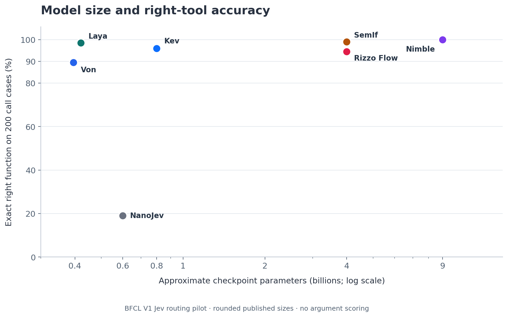
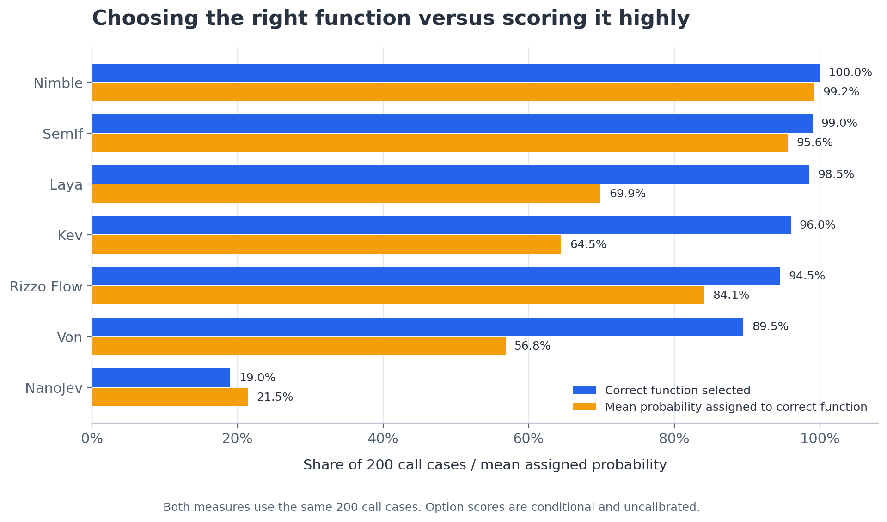

# BFCL V1 Jev routing charts

These figures are generated from the seven committed [per-case selection logs](../results/README.md). The selected benchmark has 250 BFCL V1 derived cases: 200 require a function and 50 require no function. **Exact right-tool accuracy** below means selecting the exact function ID on the 200 call cases; it does not check arguments, execution, or final answers. This is a selected routing pilot, not an official BFCL leaderboard result.



**Model size versus accuracy.** The horizontal log scale uses approximate published checkpoint/backbone sizes. A larger checkpoint does not imply a more capable router from these seven points: the models differ in training, scoring, and native prompt encoding. NanoJev's public checkpoint is trained on games, so this BFCL task is outside its training domain.


**Latency versus accuracy.** The horizontal axis is the arithmetic mean of `wall_latency_ms` over all 250 saved responses, including first-request warmup. The runs were sequential on a DGX H100, but used different inference libraries, model precision, and prompt encodings. These timings describe the observed runs, not a controlled throughput or deployment benchmark. Median and 95th-percentile values are in [metrics.json](metrics.json).



**Selection versus assigned probability.** Both bars use only the same 200 call cases. Blue is the fraction whose predicted function exactly matches the gold function. Orange is the arithmetic mean of the model's saved probability for that gold function. The option scores are conditional on each model's offered choices and scoring method; they are not independently calibrated, so differences in the orange bars should not be read as a calibration ranking. The earlier all-250 **correct route probability** also counts the summed `no_tool`, `clarify`, and `cannot_answer` probability on 50 no-call cases; it is a distinct metric and is retained in [metrics.json](metrics.json).

## Rebuild and audit

```bash
python3 -m venv charts/.venv
charts/.venv/bin/python -m pip install -r charts/requirements.txt
charts/.venv/bin/python charts/build_charts.py
```

The script checks the pinned case-file SHA-256, exactly 250 matching case IDs per model, 200 call cases, zero request errors, and agreement with each saved score summary. It then writes [metrics.json](metrics.json) and PNG/SVG pairs for all three figures. Source logs and model revisions are in [`results/`](../results/README.md). The SVG files are suitable for print; the PNG files embed reliably in Hugging Face Markdown.

| Plotted model | Approximate parameters | Size source |
| --- | ---: | --- |
| Laya typed-decisions | 421M | [Checkpoint card](https://huggingface.co/convaiinnovations/laya-typed-decisions) |
| Kev-0.8B | 0.8B | [Checkpoint card](https://huggingface.co/jaredpalmer/kev-0.8b) |
| Bespoke Nimble 9B | 9B | [Checkpoint card](https://huggingface.co/bespokelabs/Bespoke-Nimble-9B) |
| SemIf on frozen Qwen3.5-4B | 4B | [Base model card](https://huggingface.co/Qwen/Qwen3.5-4B), [SemIf method](https://github.com/TheoLeeCJ/SemIf-OpenJev) |
| Rizzo Flow 4B | 4B | [Checkpoint card](https://huggingface.co/rizzoaiacademy/rizzo-flow) |
| Von | 395M | [Checkpoint card](https://huggingface.co/wfzyx/von) |
| NanoJev | 0.6B | [Checkpoint card](https://huggingface.co/C-Tianyu/NanoJev) |

The numbers above are rounded model-family or backbone sizes, not a recount of every adapter or decision-head weight. In particular, SemIf uses a frozen base model rather than a separate trained checkpoint.
