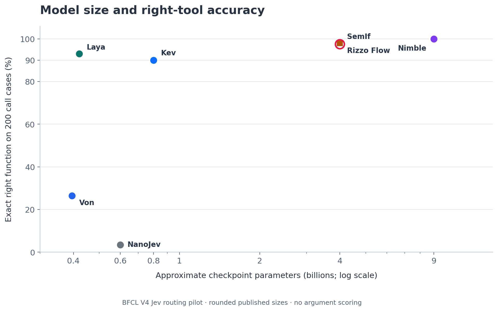
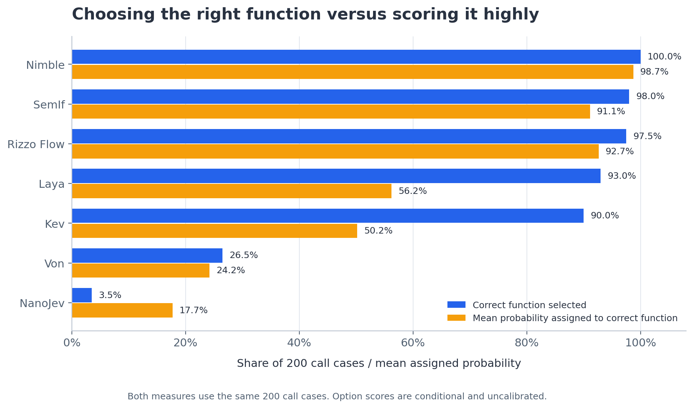

# BFCL V4 Live routing figures

Generated from the seven complete saved prediction logs and the frozen 250-case set. All three accuracy axes use the **200 tool-required cases**, with the exact function ID as the target; arguments and execution are not scored. Sizes are approximate published backbone counts. See [the full results](../../results/bfcl_v4.md) for all 250 routing scores, breakdowns, latency, probability definitions, and caveats.

## Model size and tool accuracy



[SVG](size_vs_right_tool_accuracy.svg). SemIf and Rizzo share an approximately 4B backbone and close scores; a square and an open circle distinguish their overlapping points.

## Observed latency and tool accuracy


[SVG](latency_vs_right_tool_accuracy.svg). Mean wall latency includes all 250 recorded rows. Warmup/resume protocols and native runtime timing boundaries differ; these observations are not controlled throughput comparisons or laptop measurements.

## Tool accuracy and gold-function probability



[SVG](accuracy_vs_gold_function_probability.svg). Both measures use the same 200 positive cases. This probability differs from the report's **mean correct-route probability**, which uses all 250 cases and sums three meta-action probabilities on negatives. Scores are conditional on the offered options and are not calibrated.

## Rebuild

```sh
python3 -m venv .cache/charts-venv
.cache/charts-venv/bin/python -m pip install -r charts/requirements.txt
.cache/charts-venv/bin/python charts/build_charts.py --bfcl-version v4
```

[metrics.json](metrics.json) records the dataset hash, metrics, and run IDs. The generator checks each result's case IDs, dataset digest, completion, and summary score. V1 figures are preserved separately in the parent folder. Model references and credits are in the [results report](../../results/bfcl_v4.md#credits-and-references).
